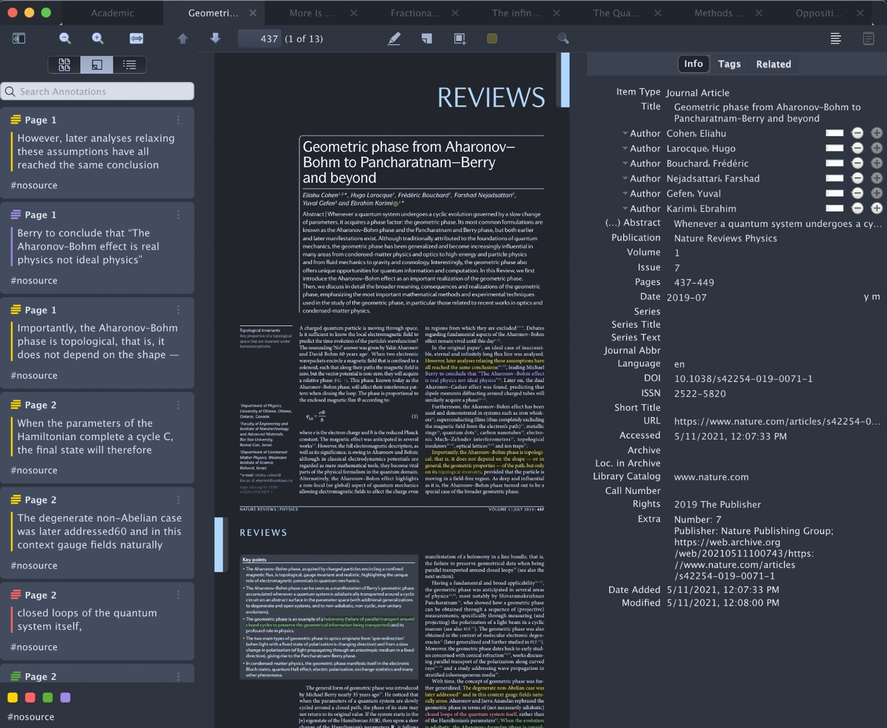

    
# 🌌 Night for Zotero

[⬇️ Download latest version](https://github.com/tefkah/zotero-night/releases/latest/download/night.xpi)

Install by downloading the [latest version](https://github.com/ThomasFKJorna/zotero-night/releases/latest)

Night theme for Zotero UI &amp; Pdf

Also adds some animations and other UI changes.

Based on the [Nord](https://github.com/arcticicestudio/nord) colorscheme and prior work by [Rosmaninho](https://github.com/Rosmaninho/Zotero-Dark-Theme).

## ✨ Features

### ◼️ Dark UI

Easier on the eyes for those late night deadlines.

### 🌚 Dark-mode for PDF

It's 2022, we can change the colors of PDFs.
Choice between two themes: a very dark one, and one that matches the background color.

### 🔁 Quick Toggle

Quickly toggle between different filters for the pdf

https://user-images.githubusercontent.com/21983833/164006109-5615d800-fbab-4174-b04e-1ad721238a61.mov

### 🌊 Miscellaneous UI improvements

Clean up the tab bar, add some animations here and there, get rid of all the borders.

## ⬇️ Install

Download the xpi from [Releases](https://github.com/ThomasFKJorna/zotero-night/releases). As always, if you're on Firefox, right-click -> Save link as....

### Video instructions

https://user-images.githubusercontent.com/21983833/168032714-6106b138-2725-4091-830b-770dbdff43a4.mov

## 😢 Limitations

- Popup menus do not have proper styling on some platforms.
- currently using CSS filter functions in order to make the pdfs dark, however this is rather slow. 

## ✅ To-do
- [ ] Make prettier, more curves. Basically redesign zotero a bit
- [ ] Add more themes
- [x] Add user preferences
- [ ] Write contributing guide

## 💪 Contributing

You're help is very welcome!
However, getting setup for Zotero plugin development is a bit of a pain in the ass.

What you need to do

- [ ] Download Zotero 60 ESR
- [ ] Git clone
- [ ] yarn
- [ ] do the zotero plugin stuff (expound on this)
- [ ] Launch zotero with --debugger and -somethingcaches
- [ ] Launch Firefox 60
- [ ] In Firefox, go to devtools, go to settings, click "enable remote debugging" and the one next to it that's also about debugging.
- [ ] In Zotero, go to setting, advanced, config editor, look up "debugging" and click on "allow remote debugging"
- [ ] In Firefox, click the hamburger menu in the top right -> web developer -> Connect...
- [ ] Enter localhost:6100
- [ ] Connect
- [ ] Click "Inspect Main Process"

Wow now you can finally do things.

## Sponsors

If you really like Zotero Night, you can consider sponsoring me monthly! 

If you donate $5/month or more, you'll be listed here and get priority for feature requests/bugfixes! (mention that you're a sponsor in the issue because i'll forget)

<!-- sponsors --><!-- sponsors -->
